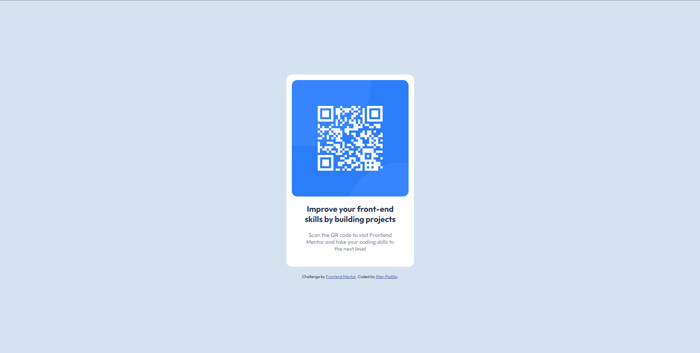
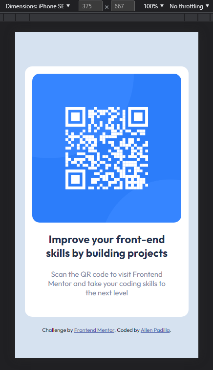

# Frontend Mentor - QR code component solution

This is a solution to the [QR code component challenge on Frontend Mentor](https://www.frontendmentor.io/challenges/qr-code-component-iux_sIO_H). Frontend Mentor challenges help you improve your coding skills by building realistic projects. 

## Table of contents

- [Overview](#overview)
  - [Screenshot](#screenshot)
  - [Links](#links)
- [My process](#my-process)
  - [Built with](#built-with)
  - [What I learned](#what-i-learned)
  - [Continued development](#continued-development)
  - [Useful resources](#useful-resources)
- [Author](#author)
- [Acknowledgments](#acknowledgments)

**Note: Delete this note and update the table of contents based on what sections you keep.**

## Overview

### Screenshot

Screenshot for the desktop view.

Screenshot for mobile view

## My process

I first started by placing some divs to contain the image, paragraph title and the paragraph itself.

After that, I started to style the html by creating an external stylesheet, then i adjusted the style to mimic the design for desktop and mobile.

For the final touch, I adjusted the font sizes and color to make it look like the design preview and formatted the html and css files to make it clean.

### Built with

- Non-semantic HTML5 markup
- CSS custom properties
- Flexbox

### What I learned

I learned how to use css custom properties (variables) to lessen code redundancy for the stylesheet.

### Continued development

I want this web page to be fully responsive in all devices in the future.

## Acknowledgments

Alberto Miguel G. Arciaga
